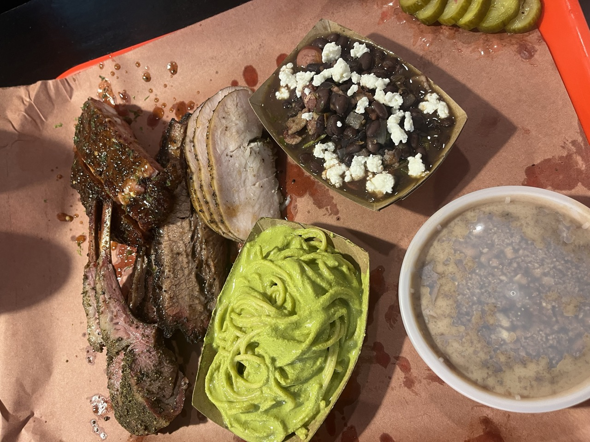

Really friendly service, great vibe. A lot of personality was put into the interior.

We got the tray for two. The rib was probably the juiciest rib I've ever had. It honestly blew my mind, and the spices used for it combined with the lime zest makes it a unique experience compared to other barbecue restaurants.

Besides the tray for two we added a lamb chop. I can totally recommended getting one (or more, they are awesome). The lamb was slightly too peppery for my taste but it was delicious.

The turkey was really juicy as well and tasted great.

As for the sides: definitely get the green spaghetti, it packs a little heat and is deliciously creamy. The beans with queso fresco were great too.

The fatty and lean brisket were both delicious and of high quality.

For the desert we had the chocolate pudding with cookie crumble, and it was amazing.

It wouldn't surprise me if Barbs-B-Q ends up taking a top 10 spot on Texas Monthly's next top 50 list. It was _that good_.

