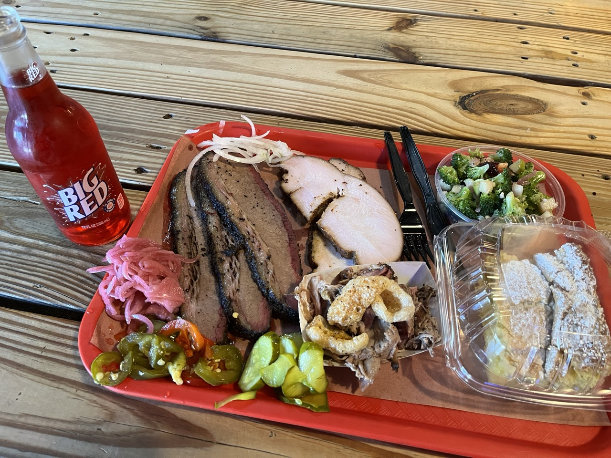

This place was high up on my list of BBQ places to try while I’m in Texas. The food here is absolutely amazing! And the staff was incredibly nice. They had run out of pork ribs when I got there just after 12pm but that’s not a big deal.

This tray cost me about $60.

The Wagyu brisket was incredibly juicy even for the lean part of the brisket. I really enjoyed the peppery flavor of the bark. The turkey was really good too. I wasn’t a big fan of the pork but thankfully I only got a small portion of it to try. The broccoli side was surprisingly tasty, and the crack cake was awesome.
