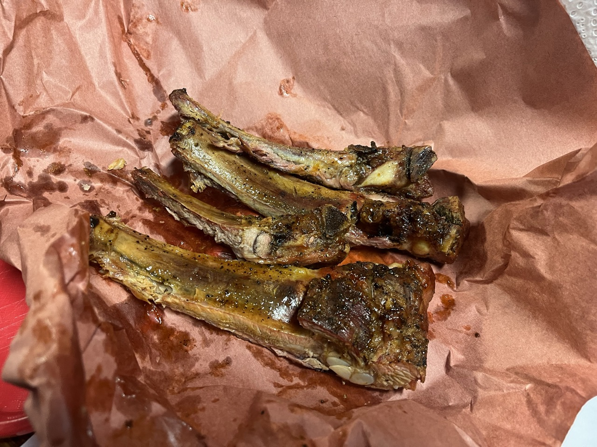
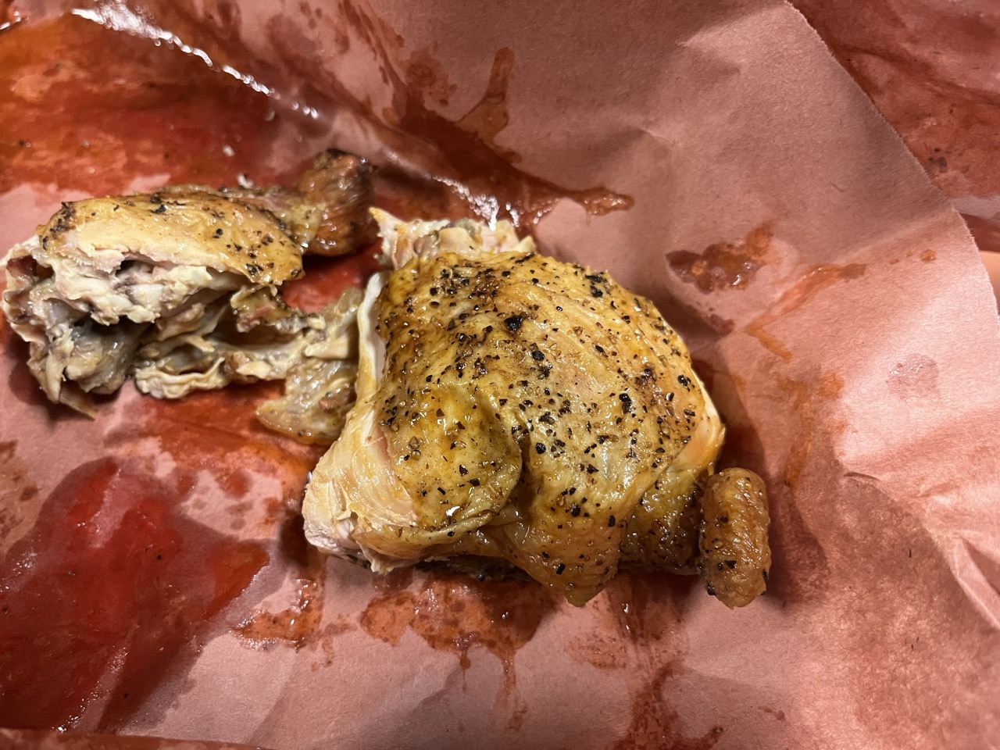

Perhaps I should try it another time and go there earlier in the day, but I can’t recommend this one around 2pm. Most of the meat was pretty dried out by this point.

We got some chicken and some pork ribs. Both were dunked in the sauce at the pit.

The thinner pork ribs were really dry. The baked potato was quite good. The mac and cheese was alright. The chicken was much better than the ribs.

If you go a bit earlier in the day while visiting the Stockyards in Fort Worth, it might be a better experience. The reviews on Google seem good, but our experience wasn't that great when visiting in the afternoon.
