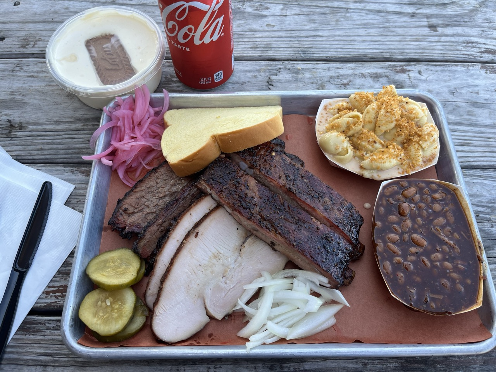

The Dampf Good BBQ food truck in North Carolina was definitely worth the visit, even if it is a bit out of the way from Raleigh. This was easily the best Texas style barbecue I’ve had that wasn’t sold in Texas.

It was quite busy on Saturday. The line was somewhere between 30 minutes and an hour I believe.

The brisket was amazing, the ribs were fantastic, the turkey was really tasty. It was so good!

The beans were a bit too sweet for my liking but still really good.

I also had the mac and cheese which was really good. It was really creamy but not super heavy on actual cheese flavor. The banana pudding with the biscoff cookie in it was awesome.

The only thing I would improve is the amount of available seating and maybe some music for the wait in line, but those are not a huge deal. Definitely recommended!
