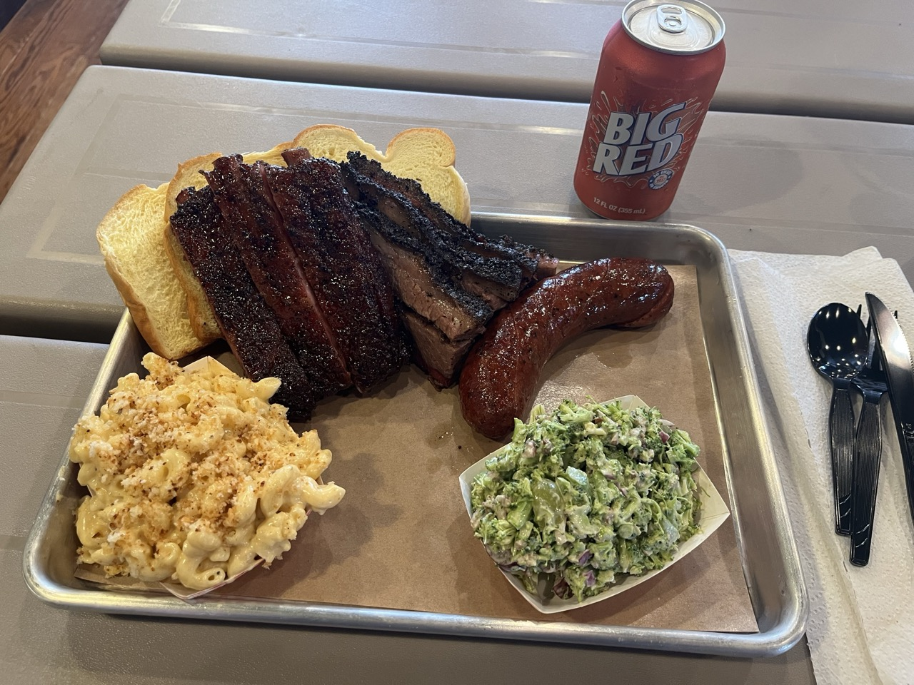

I got there around 12:30p. Unfortunately they ran out of pork brisket and jalapeno sausage.

The atmosphere is great in the restaurant. Definitely take a look at the wall of photos and news articles while you're in line.

I ordered the Texas trinity: brisket, ribs, and sausage with 2 sides. I also got a shirt.

The brisket is amazing in a delicious melt in your mouth kind of way. It is definitely extra peppery fatty brisket. It tastes great, but it also overpowers the ribs unfortunately.

The ribs a bit bland after trying the brisket. I also prefer a bit more bite to the ribs but that is just personal preference.

The sausage was nice too, but I’m not super into sausages myself. I also heard great things about their sausage specials but I did not get those.

The mac and cheese is good but not special. I can recommend the broccoli salad as a side. The broccoli salad was tasty and a nice way to reset your palate between bites of barbecue.

I don't like giving Dayne's a 3.5/5 but compared to other places it seems fair given most barbecue places seem more balanced when it comes to the flavors between the different bites.
