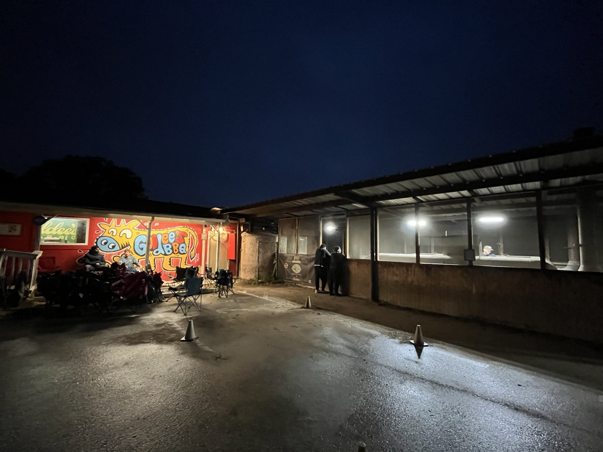
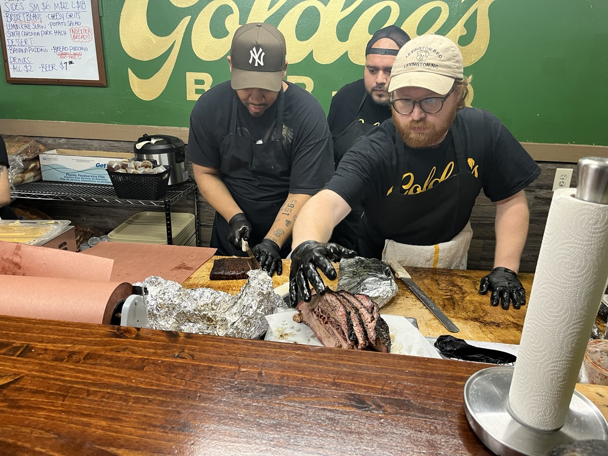
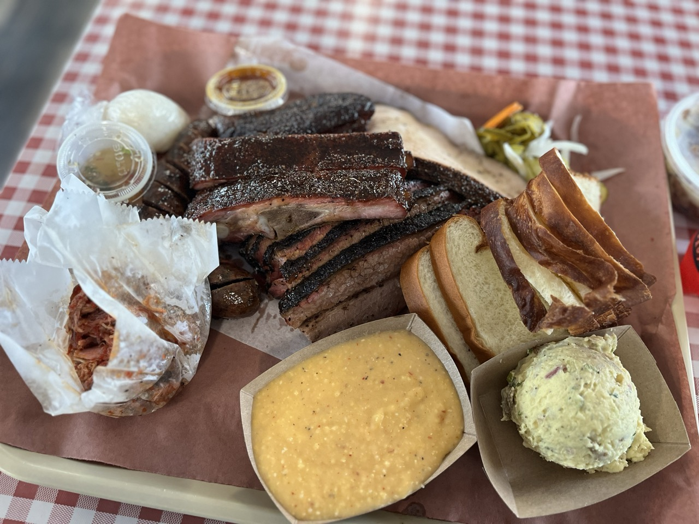

Known as the number 1 spot from the Texas Monthly list of top barbecue restaurants, I just had to go to Goldees. I got up at 6am and was at the restaurant at 7:30AM to get in line. There were 4 people already waiting in line. Goldees open at 11AM and closes at 3PM or earlier if they run out of food to sell. So it was a 3.5 hour wait until they opened their doors.

If you get there later there is a big chance that they will run out of some of the items on the menu. You should also consider bringing a folding or camping chair for the long wait.

Pro tip, if you want to get a hat or a shirt, you can actually go in the building earlier than 11AM just to buy those things. Including the tip I spend almost $140 on food, but I knew beforehand that a big portion of it would be taken to-go after I was finished eating.

I just wanted to make sure I could try most of the menu when it was fresh and the rest I could reheat later although right now at 2PM I still feel very full and I doubt I’ll be hungry anytime soon.

The brisket is exactly as you would expect at the number one rated barbecue restaurant in Texas: cooked to perfection.
The ribs were some of the best I’ve had and my favorite bite on the plate. Unfortunately I only got two of them. They were not overly sweet, not overly peppery, and had a good bite to them while still being juicy.

The thing that surprised me the most is that every item on my plate was of phenomenal quality. A lot of barbecue restaurants are known for one or two of their items. But at Goldees the whole menu was amazing.

I’m not usually that much into sausage, but their Laosian sausage was incredibly tasty and definitely something special.

The pork belly was really juicy and the taste was absolutely phenomenal combined with the peach sauce you get with it. I will say though that I prefer Interstellar's peach tea pork belly.

Even the turkey slices were really juicy and delicious, which is something I’ve come to appreciate more and more at good barbecue restaurants.

As for the sides I got the potato salad and the cheesy grits. The potato salad was my favorite of the two sides. This was my first time trying cheesy grits and it wasn’t really my thing. It was alright but I can’t really compare it to any other restaurants since I never had it anywhere else.

A friend of mine who lives in Texas came along with me for the trip to Goldees and he said it was definitely worth the wait.
For desert they unfortunately did not have banana pudding that day, but the bread pudding with rum sauce was a surprisingly good alternative.
