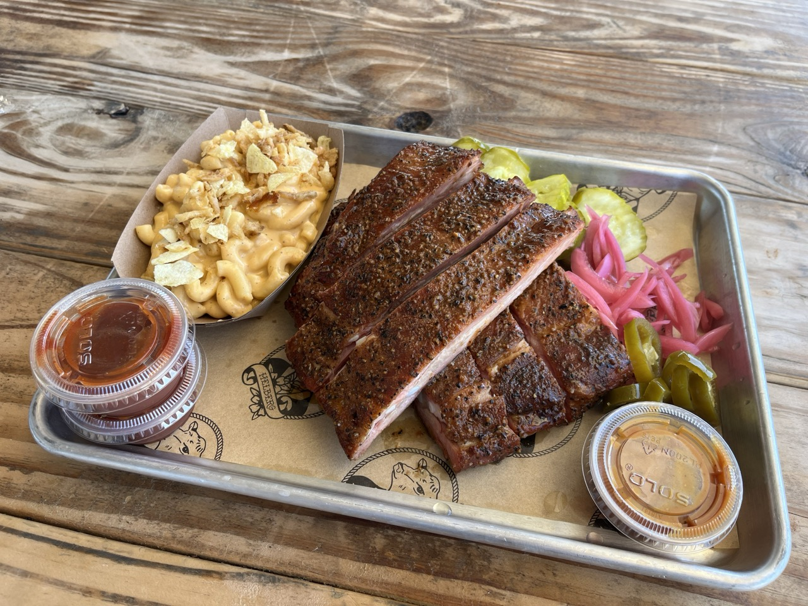

Helberg Barbecue is a foodtruck with outdoor seating. I recommend not wearing your good shoes as they will get dirty.

The staff is great and really friendly. We got here around noon on a Wednesday and there were only a handful of people in line before us when we arrived, with a lot more people already seated and eating.

We got all of our food in about 15 minutes.

The ribs and chicken were recommended to us by a friend so we got both of them. Ribs had a good bite to them but still really juicy. Some of the juiciest ribs I’ve ever had. Crispiest chicken skin ever.

The Mac and cheese was delicious and very creamy.

On Wednesday when we visited, you had a deal where you could get a full rack ribs for only 6 extra dollars over a half rack.

We did not eat a whole lot of different meats here so I can't really give it a 5/5 in fairness, but the food that we had was great!
