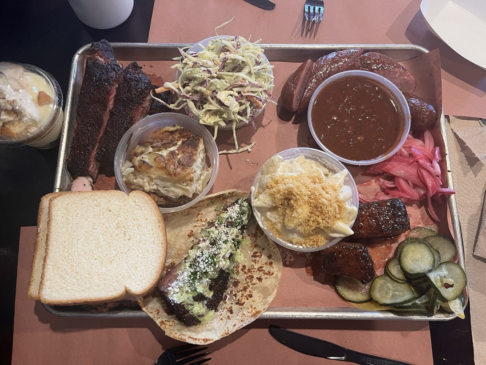

I was super excited to go back to Interstellar. It was my first barbecue restaurant in the US I ever visited and what got me to fall in love with Texas style barbecue in the first place. But that means that at the time, I didn’t have anything to compare it to. So does it still hold up?

We got here just after the restaurant opened on a Sunday, and had to wait 2 hours to get to the counter to order the food. Unfortunately the lamb and the beef short ribs had sold out by then. Our total was about $90. We got the slices brisket taco (the last one they had!), half a pound of pork ribs, 1/4lbs peach tea glazed pork belly, 1/4lbs tipsy turkey, and the German sausage special of the day.

We also got a lot more sides than usual. We had the smoked scallop potatoes which I heard great things about. They were good, but didn’t wow me. Maybe they are slightly overhyped.

The ranch style beans had a bit of a spicy kick to them and were pretty good. Definitely not as sweet as some beans you might get at other places. The jalapeño slaw was great and also had a spicy kick to them that sneaks up on you after a couple bites.

The mac and cheese is made from smoked Gouda cheese and was some of the best we had. The cheesy flavor comes through much better than some other places we had mac and cheese at. It was also less creamy than others but that isn’t necessarily a bad thing.

For the meats, the brisket taco was definitely the winner of the plate for me. The tipsy turkey was good although it didn’t really have the beer flavor you might expect given the name. It wasn’t dry, but it also wasn’t as juicy as the turkey I’ve had at other restaurants, which is what I would prefer. The pork belly was amazingly soft and almost had a creamy inner texture to it. Absolutely fantastic bite if you’re into sweet glazes. The ribs were nice, but I had higher expectations from because that was the bite I vividly remembered from my first trip to Interstellar and it being my first Texas style barbecue experience. I’m not super into sausages that are made out of just pork myself, but I could tell that the German sausage (pfälzer bratwurst) was high quality sausage. Not my favorite but that is just a preference thing.

The banana pudding was high on my list for things I wanted to try again. And it was just as good as I remembered! There are nilla wafers and slices of banana in it, combined with either bread/cookie crumble and a swirl of caramel sauce. Absolutely amazing way to end your meal even if you’re already feeling pretty full.

Coming back to the question “does interstellar still hold up, compared to my first visits?” I would say yes and no. I could see myself revisiting just for my favorite items from the menu, but at the same time I’ve had much better ribs at many other barbecue restaurants.
