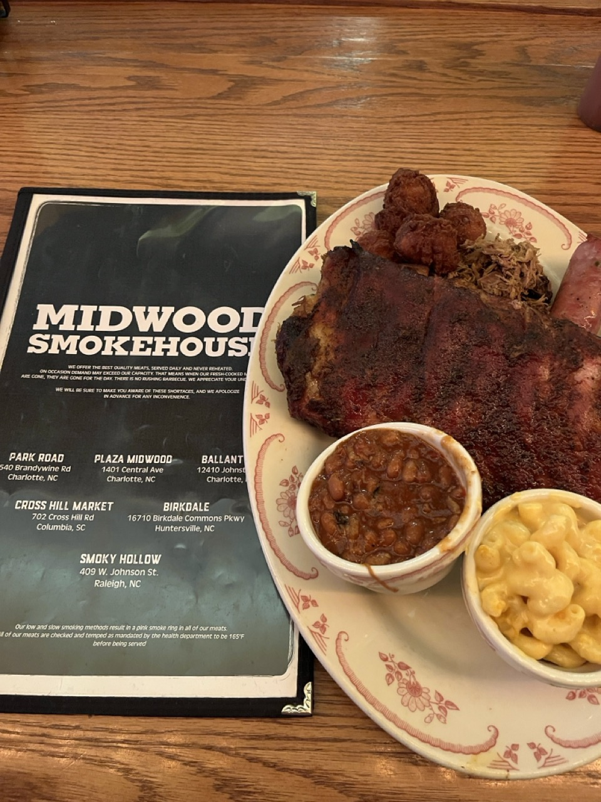

This was my first stop on my holiday in the US. The BBQ was pretty good considering it was still readily available at 8PM.

I ordered the combo meal with ribs, brisket, sausage and Carolina pork.

The brisket and Carolina pork were nice, but the ribs and sausage weren’t that great. The smoke flavor was very subtle.

The sides made up for it though. The mac and cheese was creamy and delicious, and the barbecue beans were really tasty as well (although the beans were sweeter than I’m used to). I really liked the hushpuppies as well.

There is a nice selection of beers on tap.

I would have to compare it to more barbecue places in the area but I would still come back for a late night bite. I don’t think I’ll be getting the ribs again though. The service was nice, and the atmosphere is great.

This place does not hold up against any barbecue restaurant I’ve been to in Texas.
