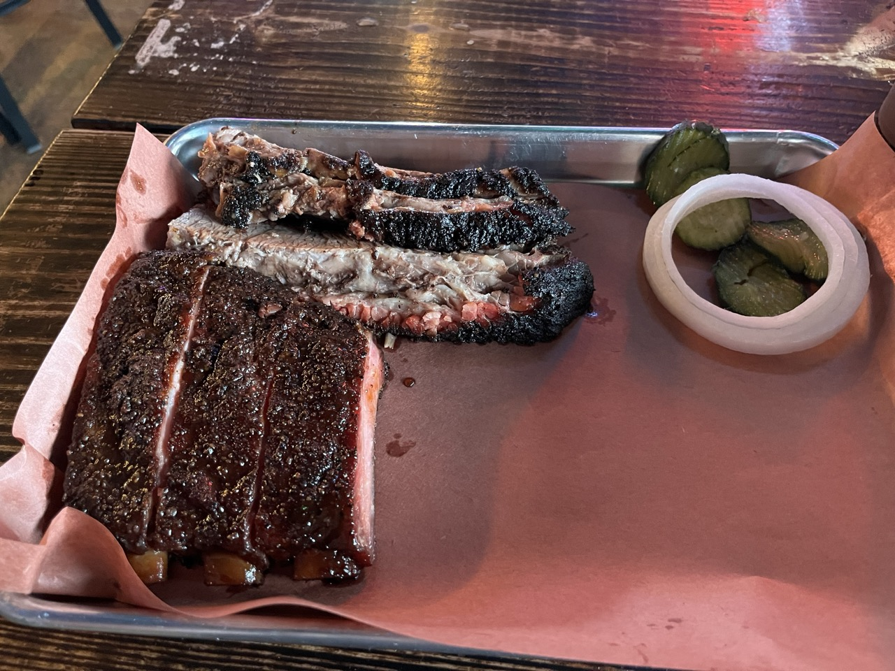
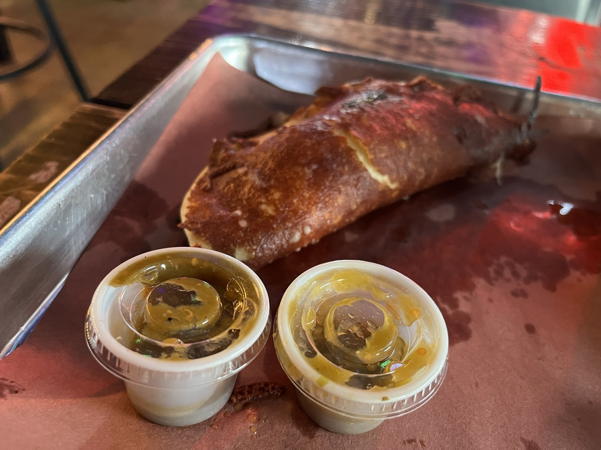

I wanted to visit Panther City BBQ because of the Mexican influences.

The ribs were seasoned differently than what I’ve had at other restaurants because of the Mexican influences at Panther City BBQ. But that’s not a bad thing, I actually really enjoyed the pork ribs.

It was pretty empty when I got there which had me a little worried, but on my way in a stranger recommeded me to get one of the specific Mexican inspired specialties called the flacodilla.

The flacodilla embodies exactly why I wanted to visit Panther City BBQ. It's a quesedilla inspired item with chopped brisket, asadero cheese, cilantro, onion, on a griddled tortilla.

The brisket was alright but not very consistent. Some of it was a bit dry, which was quite surprising to me considering their high placement on Texas Monthly’s list. Maybe I caught them on a bad brisket day? Anyway it was still really good overall.
